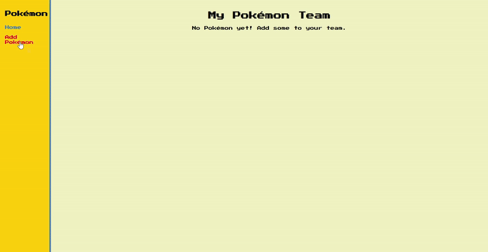

# Web Development Project 7 - Pokémon Team Builder

Submitted by: **Hai Hoang**

This web app: **allows users to create and manage their own Pokémon team. Users can add Pokémon with a name, type, level, and favorite move, view them in a team gallery, edit their information, and delete them. Each Pokémon has its own detail page showing its info and sprite. The app uses Supabase for database storage and CRUD functionality.**

Time spent: **12** hours spent in total

## Required Features

The following **required** functionality is completed:

- [x] **The web app contains a page that features a create form to add a new Pokémon**
  - Users can name the Pokémon
  - Users can set the Pokémon’s attributes such as type, level, and favorite move
- [x] **The web app includes a summary page of all the user’s added Pokémon**
  - The web app contains a summary page dedicated to displaying all the Pokémon the user has made so far
  - The summary page is sorted by creation date such that the most recently created Pokémon appear at the top
- [x] **A previously created Pokémon can be updated from the list of Pokémon in the summary page**
  - Each Pokémon has an edit button that will take users to an update form for the relevant Pokémon
  - Users can see the current attributes of their Pokémon on the update form
  - After editing the Pokémon's attribute values using the form, the user can immediately see those changes reflected in the update form and on the summary page 
- [x] **A previously created Pokémon can be deleted from the Pokémon list**
  - Using the edit form detailed in the previous _Pokémon can be updated_ feature, there is a button that allows users to delete that Pokémon
  - After deleting a Pokémon, the Pokémon should no longer be visible in the summary page
  - [x] **Each Pokémon has a direct, unique URL link to an info page about them**
    - Clicking on a Pokémon in the summary page navigates to a detail page for that Pokémon
    - The detail page contains extra information about the Pokémon not included in the summary page
    - Users can navigate to the edit form from the detail page

The following **optional** features are implemented:

- [ ] A Pokémon can be given a category upon creation which restricts its attribute value options
- [ ] A section of the summary page displays summary statistics about a user’s team (planned but not implemented)
- [ ] The summary page displays a custom “team strength” metric that changes the look of the team list (planned but not implemented)

The following **additional** features are implemented:

* [x] Pokémon sprites automatically display based on the Pokémon’s name
* [x] Full Pokémon-themed styling:  
  - Yellow and blue Pokémon color scheme  
  - Retro game font (Press Start 2P)  
  - Animated hover effects on cards  
* [x] Responsive card grid layout for Pokémon gallery

## Video Walkthrough

Here's a walkthrough of implemented user stories:

GIF created with ezgif

## Notes

Challenges encountered while building the app:

* Configuring **Supabase RLS policies** correctly — without an “allow all” policy for the `anon` role, the app could not insert or fetch Pokémon.
* Debugging 401 Unauthorized errors when the environment variables or RLS policies were misconfigured.
* Ensuring the **sprite URL updates** correctly when editing a Pokémon’s name.

## License

    Copyright 2025 Hai Hoang

    Licensed under the Apache License, Version 2.0 (the "License");
    you may not use this file except in compliance with the License.
    You may obtain a copy of the License at

        http://www.apache.org/licenses/LICENSE-2.0

    Unless required by applicable law or agreed to in writing, software
    distributed under the License is distributed on an "AS IS" BASIS,
    WITHOUT WARRANTIES OR CONDITIONS OF ANY KIND, either express or implied.
    See the License for the specific language governing permissions and
    limitations under the License.